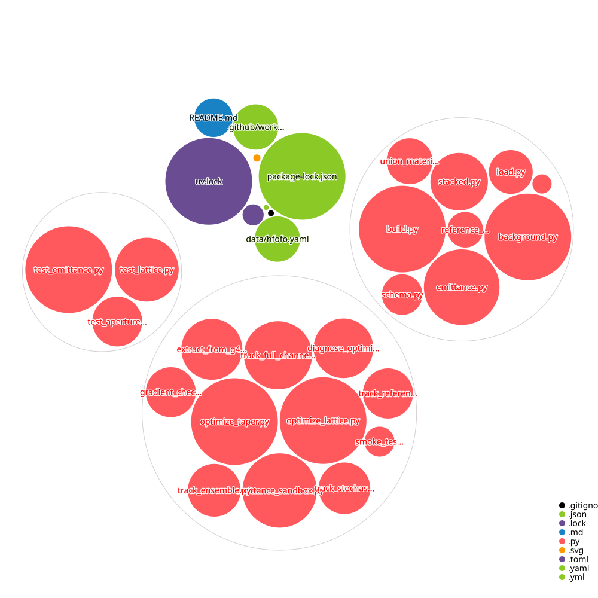

# hfofo-beamline

An **application** of the [`beamline`](https://github.com/headunderheels/beamline)
differentiable beamline simulator: it reconstructs the frozen HFOFO snake
cooling channel (31 periods of alternating-sign solenoids, 325 MHz pillbox RF,
and LiH wedge absorbers) from extracted lattice data and assembles it into
`beamline` field/material objects for tracking.

## Layout

```
src/hfofo/
  schema.py   # dataclass records: Solenoid, Cavity, Wedge, Rotation, Lattice
  load.py     # YAML -> typed records (with validation)
  build.py    # typed records -> beamline SumField channel
data/
  hfofo.yaml  # the extracted lattice (fully explicit, human-editable)
scripts/
  extract_from_g4bl.py  # one-time deck -> YAML extraction (provenance only)
tests/
  test_lattice.py
```



## Data provenance

`data/hfofo.yaml` is extracted once from the G4Beamline frozen input
(`criggall/muon-cooling` `hfofo-frozen/g4bl-input/track_v7.in` and its includes)
by `scripts/extract_from_g4bl.py`. That script is the *only* place that parses
the G4BL DSL; nothing in `src/hfofo` depends on it. All angles are converted to
**radians** and `z` to **absolute mm** at extraction time. To regenerate:

```bash
python scripts/extract_from_g4bl.py \
    --input-dir /path/to/muon-cooling/hfofo-frozen/g4bl-input \
    --out data/hfofo.yaml
```

## Setup

```bash
uv sync
uv run pytest
```

The `beamline` dependency is pinned to commit `c01b42f` (which includes the
`WedgeVolume`/`AbsorberWedge` geometry and the `SumField` summing fix).

## Status

- Milestone A (lattice: solenoids + RF assembled into a channel): **working.**
- **Performance:** the naive `build_channel` (loop-based `SumField`) does not
  scale -- 566 components take ~5 min eager and OOM under `jit`. Use
  **`build_channel_batched`**, which stacks same-typed components and evaluates
  them with `vmap` (`src/hfofo/stacked.py`): the full channel compiles in ~4s and
  evaluates in ~0.02s cached (a ~12,000x speedup). `build_channel` is kept as a
  correctness oracle -- `tests/test_lattice.py::test_batched_matches_oracle_rf`
  (marked `slow`) asserts the two agree. The batched field-sum is general and is
  intended to be lifted upstream into `beamline` once proven here.
- The solenoid `current -> jphi` conversion (`AMP_TO_JPHI`) is an exact
  physical unit conversion (Amp -> e/ns), not a fit. Solenoids are modeled as
  `ThickSolenoid` (uniform-current-density annulus, G4BL's own `nSheets=10`
  discretization) -- verified bit-for-bit against a standalone compile of
  G4BL's actual `BLCoil.cc`. See `build.py`'s CALIBRATION note.
- Wedges (milestone C) are built into material volumes (`build_wedges`,
  `UnionMaterial`) and used by the stochastic tracker (`scripts/track_stochastic.py`).

## Tests

```bash
uv run pytest            # fast suite (~7s)
uv run pytest -m slow    # + the eager-loop oracle comparison (~3 min)
```
